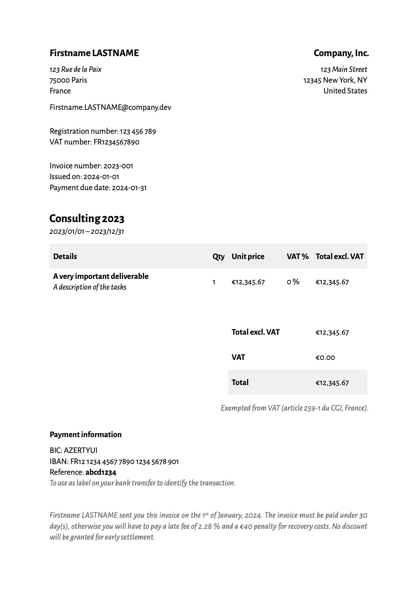

# Invoice Format Template (Typst)

This is a Quarto template that assists you in creating PDF invoices via Typst.

## Creating a New Invoice

You can use this as a template to create an invoice.
To do this, use the following command:

```bash
quarto use template mcanouil/quarto-invoice
```

This will install the extension and create an example qmd file that you can use as a starting place for your invoice.

## Installation For Existing Document

You may also use this format with an existing Quarto project or document.
From the Quarto project or document directory, run the following command to install this format:

```bash
quarto add extension mcanouil/quarto-invoice
```

## Usage

To use the format, you can use the format name `invoice-typst`.
For example:

```bash
quarto render template.qmd --to invoice-typst
```

or in your document yaml

```yaml
format:
  invoice-typst:
    lang: en_UK
    papersize: a4
    margin:
      x: 2.5cm
      y: 2.5cm
    mainfont: "Alegreya Sans"
    fontsize: 12pt 
```

You can view a preview of the rendered template below:


